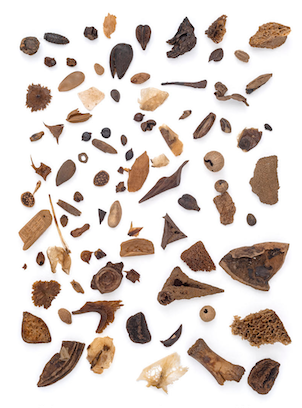

# Archeobotanie

## Korte beschrijving van de thema-avond
Archeologen proberen door materialen en voorwerpen uit het verleden te onderzoeken zo goed mogelijk te achterhalen hoe mensen vroeger leefden. Ook oude plantenresten die bij opgravingen gevonden worden kunnen daarbij gebruikt worden. Zo kunnen onverteerde zaden en andere voedselresten die achter zijn gebleven in middeleeuwse beerputten (een soort ouderwetse WC's) helpen om te ontdekken wat men in die tijd zoal at. Was dit echt zo anders dan nu? Door met een microscoop op zoek te gaan naar plantaardige resten in oude poep uit een Groningse beerput (wees gerust: het stinkt niet meer), kan je zelf aan de slag gaan om dit te ontdekken.

*Deze thema-avond wordt gegeven door Liam van den Bosch, Sanne Smit, Mila Zandstra en Daphne van der Velde, studenten Archeobotanie aan de Rijksuniversiteit Groningen*

## Praktische informatie
- Datum: **28 februari 2025**
- Locatie: Archeobotanisch lab, Broerstraat 9
- Tijd: 18 tot 20 uur
- Minimumleeftijd: 8 jaar
- Maximumaantal deelnemers: 10
- Kosten: 2,50 euro per deelnemer
