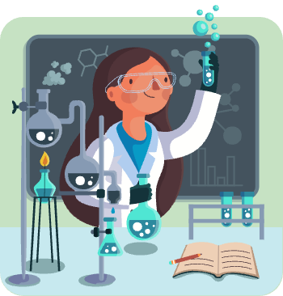

# Atomen, moleculen en chemische reacties

## Korte beschrijving van de thema-avond
Onze wereld is opgebouwd uit onvoorstelbaar kleine bouwsteentjes: de elementen. Waar komen die vandaan, hoe vormen ze alle stoffen (moleculen) om ons heen, en wat gebeurt er eigenlijk als die met elkaar reageren? Tijdens deze thema-avond duiken we in de basis van de scheikunde, waarbij we natuurlijk ook aan de slag gaan met allerlei soorten chemische reacties.

## Praktische informatie
- Datum: **8 mei 2026**
- Locatie: De Jonge Onderzoekers Groningen, Dirk Huizingastraat 13
- Tijd: 18.15 tot 20 uur (pauze: 19 tot 19.15 uur)
- Minimumleeftijd: 8 jaar
- Maximumaantal deelnemers: 10
- Kosten: 2,50 euro per deelnemer
