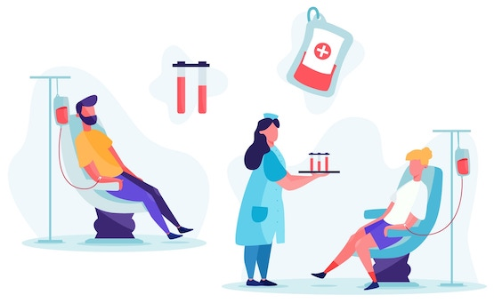

# Bloed en bloedtransfusie

## Korte beschrijving van de thema-avond
Door ons lichaam stroomt in totaal zo’n 5 liter bloed. Meestal merk je daar niks van, totdat het via bijvoorbeeld een wond naar buiten komt. Maar wat is bloed eigenlijk precies? Wanneer heb je een bloedtransfusie nodig? En waarom kan je alleen bloed van een passende donor ontvangen? Tijdens deze thema-avond in het UMCG zullen een laboratoriumspecialist en een hematoloog je hier van alles over vertellen. Je gaat ook zelf onderzoekjes uitvoeren met echt bloed in een laboratorium om te ontdekken hoe bloed eruitziet, hoe je de bloedgroep kunt bepalen en welk donorbloed bij welke patiënt past.

*Deze thema-avond wordt gegeven door Karina Meijer (hematoloog) en Michaël Lukens (klinisch chemicus) van het UMCG*

## Praktische informatie
- Datum: **21 maart 2025**
- Locatie: UMCG
- Tijd: 18 tot 20 uur
- Minimumleeftijd: 8 jaar
- Maximumaantal deelnemers: 12
- Kosten: 2,50 euro per deelnemer
