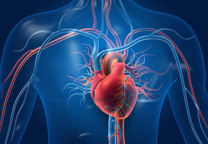

# Hart en bloedsomloop

## Korte beschrijving van de thema-avond
Ons hart pompt continu bloed door het lichaam. Hierdoor kan zuurstof overal terechtkomen. Waarom is dat nodig, waar bestaat bloed eigenlijk uit en hoe werkt je hart precies? Voor de antwoorden hierop gaan we onder andere een echt varkenshart bekijken en daarnaast doe je enkele metingen aan je eigen hartslag. Als je wilt kan je met een speciale computersensor zelfs een hartfilmpje (een ECG) van jouw kloppende hart maken.

## Lesmateriaal
De gebruikte presentatie, inclusief een samenvatting, is na afloop hier te downloaden.

## Praktische informatie
- Datum: **1 maart 2024**
- Locatie: De Jonge Onderzoekers Groningen, Dirk Huizingastraat 13
- Tijd: 18.15 tot 20 uur (pauze: 19 tot 19.15 uur)
- Minimumleeftijd: 8 jaar
- Maximumaantal deelnemers: 10
- Kosten: 2 euro per deelnemer
