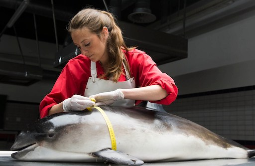

# De bruinviszaak

## Korte beschrijving van de thema-avond
Er is een dode bruinvis (een walvisachtige) aangespoeld op het strand. Op zijn lichaam zijn opvallende verwondingen te zien. Wat is hier gebeurd? Waardoor zijn de verwondingen veroorzaakt? Tijdens deze les kruip je in de huid van een onderzoeker en leer je meer over het leven van bruinvissen, wat ze eten en ook door wie ze zelf gegeten worden. Daarnaast ga je zelf onderzoeken welk roofdier verantwoordelijk is geweest voor de aanval op de aangespoelde bruinvis. Hiervoor maak je gebruik van (gesimuleerd) DNA-onderzoek.

## Praktische informatie
- Datum: **10 oktober 2025**
- Locatie: De Jonge Onderzoekers Groningen, Dirk Huizingastraat 13
- Tijd: 18.15 tot 20 uur (pauze: 19 tot 19.15 uur)
- Minimumleeftijd: 8 jaar
- Maximumaantal deelnemers: 10
- Kosten: 2,50 euro per deelnemer
