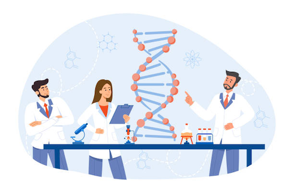

# DNA-onderzoek

## Korte beschrijving van de cursus
Onze erfelijke eigenschappen liggen opgeslagen in ons DNA. DNA bestaat uit een soort letters die samen een genetische code vormen. Deze genetische code is voor iedereen een beetje verschillend. Om te kunnen bepalen welke genetische variant je hebt voor een bepaalde eigenschap, kun je je DNA (laten) testen. Meestal moet je dan je DNA opsturen naar een laboratorium, maar tijdens deze minicursus mag je helemaal zelf zo’n DNA-test gaan uitvoeren met je eigen DNA! De eigenschap die we gaan onderzoeken is het wel of niet kunnen proeven van een bittere stof (PTC). Je leert hierbij meer over DNA, welke gevolgen kleine verschillen in de genetische code kunnen hebben en wat je allemaal te weten kunt komen met DNA-onderzoek.

## Cursusmateriaal
Hier kan je de gebruikte presentaties met een uitgebreide samenvatting downloaden.

Klik [hier](dna-onderzoek1.pdf) voor deel 1. 
Klik [hier](dna-onderzoek2.pdf) voor deel 2.

## Praktische informatie
- Cursusdata: **13 + 20 september 2024**
- Locatie: De Jonge Onderzoekers Groningen, Dirk Huizingastraat 13
- Tijd: 18 tot 20 uur
- Minimumleeftijd: 8 jaar
- Maximumaantal deelnemers: 12
- Kosten: 4 euro per deelnemer
