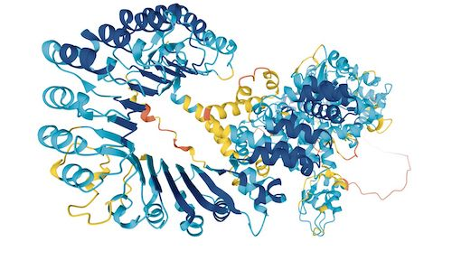

# Eiwitten

## Korte beschrijving van de thema-avond
Alles wat leeft bestaat voor een groot deel uit eiwitten. Dit zijn hele grote (bio)moleculen. Ze hebben allerlei belangrijke functies in onze cellen, zoals helpen bij chemische reacties of het opbouwen van het lichaam. Ook in onze voeding zijn ze onmisbaar. En sommige ziektes ontstaan bijvoorbeeld doordat er iets mis is met de vorm van bepaalde eiwitten in een cel. Dat is een van de redenen waarom er veel onderzoek wordt gedaan aan eiwitten. Tijdens deze thema-avond leer je hier van alles over en ga je zelf ook verschillende experimenten doen in het lab.

## Praktische informatie
- Datum: **12 juni 2026**
- Locatie: Linnaeusborg, Nijenborgh 7, 9747 AG Groningen
- Tijd: 18 tot 20 uur *(onder voorbehoud)*
- Minimumleeftijd: 8 jaar
- Maximumaantal deelnemers: 10
- Kosten: 2,50 euro per deelnemer
