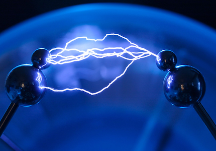

# Elektriciteit

## Korte beschrijving van de thema-avond
Wat hebben bliksem en een stopcontact met elkaar gemeen? Inderdaad: elektriciteit. Maar wat is dat nou eigenlijk? Je kan het niet vastpakken (sterker nog: aanraken kan erg gevaarlijk zijn!), maar toch stroomt het door je apparaten heen. En je voelt het vast wel eens zodra je bij schraal weer een deurkruk vastpakt of een trui uittrekt en ineens een schokje krijgt. Dit wordt statische elektriciteit genoemd. Tijdens deze 'schokkende' thema-avond over elektriciteit leer je meer over dit verschijnsel en gaan we verschillende experimenten doen.

*Deze thema-avond wordt gegeven door Ynze van der Spek, docent natuurkunde aan het Parcival College*

## Praktische informatie
- Datum: **17 april 2026**
- Locatie: De Jonge Onderzoekers Groningen, Dirk Huizingastraat 13
- Tijd: 18 tot 20 uur (pauze: 19 tot 19.15 uur)
- Minimumleeftijd: 8 jaar
- Maximumaantal deelnemers: 10
- Kosten: 2,50 euro per deelnemer
