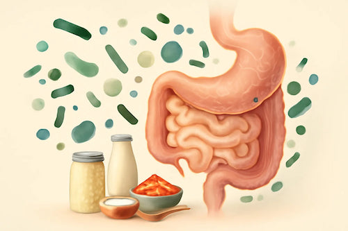

# Bacteriën in je eten?

## Korte beschrijving van de thema-avond
Micro-organismen (zoals bacteriën en schimmels) zijn overal om ons heen aanwezig. We kunnen niet zonder ze, maar sommige ervan kunnen ons ook ziek maken. De meeste zijn gelukkig juist goed voor ons en voor de natuur. Ze zitten zelfs op en in ons lichaam, en we kunnen ze gebruiken voor nuttige dingen zoals voedsel maken. Dat heet ‘fermenteren’. Fermenteren is wetenschap in actie! Goede bacteriën zetten suikers in groenten om in zuren. Daardoor kun je het langer bewaren en de groenten worden er ook lekkerder van (vinden veel mensen). En als je de groenten eet, doen de bacteriën ook nog eens veel goeds voor je darmen. Tijdens deze thema-avond leer je hier veel meer over en ga je ook zelf aan de slag met fermentatie.

*Deze thema-avond wordt deels gegeven door Leonie Bais, https://www.leoniebais.nl*

## Praktische informatie
- Datum: **13 november 2026**
- Locatie: De Jonge Onderzoekers Groningen, Dirk Huizingastraat 13
- Tijd: 18 tot 20 uur (pauze: 19 tot 19.15 uur)
- Minimumleeftijd: 8 jaar
- Maximumaantal deelnemers: 10
- Kosten: 2,50 euro per deelnemer
