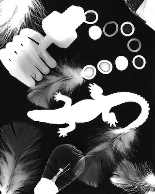

# Fotografische technieken

## Korte beschrijving van de thema-avond
Tegenwoordig maken we foto's met onze mobieltjes, maar voordat we digitale camera's hadden ging dit net even anders. Om een gemaakte foto terug te kunnen zien, moest deze namelijk eerst ontwikkeld en afgedrukt worden. Dit gebeurde in een donkere kamer. Met speciaal fotografisch papier en chemicaliën, kon het beeld langzaam zichtbaar worden gemaakt. Tijdens deze thema-avond ga je de 'magie' van dit proces zelf ontdekken door in een echte donkere kamer (doka) aan de slag te gaan met zogeheten fotogrammen. Ook leer je meer over fotografische principes en hoe een gaatjescamera werkt.

## Praktische informatie
- Datum: **16 mei 2025** *(Bij grote belangstelling: herhaling op 23 mei)*
- Locatie: Bij VRIJDAG, Walstraat 34
- Tijd: 18 tot 20 uur
- Minimumleeftijd: 8 jaar
- Maximumaantal deelnemers: 6
- Kosten: *(Volgt z.s.m.)*
