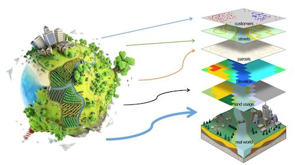

# Kaarten en geografische informatiesystemen

## Korte beschrijving van de thema-avond
Heb je altijd al je eigen kaarten willen maken? Dat gaan we doen! Welkom in de wereld van GIS: Geografische Informatie Systemen. Met GIS komen aardrijkskunde en computers samen, en zo kan je met data je eigen kaarten maken. Met GIS kan je ook antwoorden vinden op allerlei vragen over de wereld. We gaan je op weg helpen met QGIS, een programma dat je gewoon gratis kan downloaden zodat je daarna ook thuis kan maken wat je wil!

*Deze thema-avond wordt gegeven door Jasper Roest, zelfstandig Geo-ICT'er bij The Right Place*

## Praktische informatie
- Datum: **16 januari 2026**
- Locatie: De Jonge Onderzoekers Groningen, Dirk Huizingastraat 13
- Tijd: 18 tot 20 uur (pauze: 19 tot 19.15 uur)
- Minimumleeftijd: 8 jaar
- Maximumaantal deelnemers: 10
- Kosten: 2,50 euro per deelnemer
