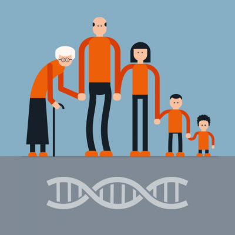

# De reis van de genen: van eicel tot nageslacht

## Korte beschrijving van de cursus
We zijn allemaal ooit begonnen als eicel. Na een geslaagde bevruchting groeiden we uit tot een heel mens, waarna het hele proces zich kan herhalen. Maar hoe zit dit bij andere dieren, planten en eencelligen? Welke manieren gebruiken zij om zich voort te planten, en doen ze dat geslachtelijk of ongeslachtelijk? En waar komen onze eigenschappen eigenlijk vandaan? Tijdens deze minicursus leer je meer over de weg die de genen afleggen vanaf het individu tot aan de nakomelingen. Daarnaast gaan we kijken naar wat DNA precies is en hoe erfelijkheid werkt. Dat doen we onder andere met behulp van fruitvliegjes en andere experimentjes.

## Cursusmateriaal
Na afloop van elke cursusavond kun je hier de gebruikte presentatie met een uitgebreide samenvatting (en eventuele andere materialen) downloaden.

## Praktische informatie
- Cursusdata: **2 + 9 juni 2023**
- Locatie: De Jonge Onderzoekers Groningen, Dirk Huizingastraat 13
- Tijd: 18.15 tot 20 uur (pauze: 19 tot 19.15 uur)
- Minimumleeftijd: 8 jaar (Richtleeftijd 10+)
- Maximumaantal deelnemers: 10
- Kosten: 4 euro per deelnemer
