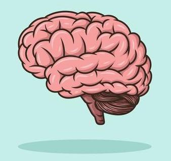

# De hersenen

## Korte beschrijving van de thema-avond
Ben jij ook zo benieuwd wat er gebeurt in je brein? In deze les duiken we er - letterlijk - in. We bespreken hoe hersenen eruitzien en hoe ze werken. Je leert van alles over hersengebieden en hersencellen. Maar dat niet alleen: we gaan ook een écht schapenbrein ontleden, dus je mag ze zelfs aanraken!

*Deze thema-avond wordt gegeven door gastdocent Cato Drion van de Rijksuniversiteit Groningen.*

## Praktische informatie
- Datum: **28 juni 2024**
- Locatie, nog onder voorbehoud: Linnaeusborg, Nijenborgh 7, 9747 AG Groningen
- Tijd: 18 tot 20 uur
- Minimumleeftijd: 8 jaar
- Maximumaantal deelnemers: 10
- Kosten: 2 euro per deelnemer
