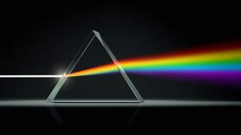

# Licht en kleuren

## Korte beschrijving van de thema-avond
We staan er meestal niet zo bij stil, maar licht is een heel bijzonder verschijnsel. Zelfs wetenschappers die er onderzoek aan doen, zitten nog met veel vragen. Maar wat weten we al wel over licht? Hoe ontstaan kleuren eigenlijk, en hoe kan je die zien? Tijdens deze thema-avond leer je hier van alles over en gaan we verschillende experimenten doen.

## Lesmateriaal
De gebruikte presentatie, inclusief een samenvatting, is na afloop hier te downloaden.

## Praktische informatie
- Datum: **17 november 2023**
- Locatie: De Jonge Onderzoekers Groningen, Dirk Huizingastraat 13
- Tijd: 18.15 tot 20 uur (pauze: 19 tot 19.15 uur)
- Minimumleeftijd: 8 jaar
- Maximumaantal deelnemers: 10
- Kosten: 2 euro per deelnemer
