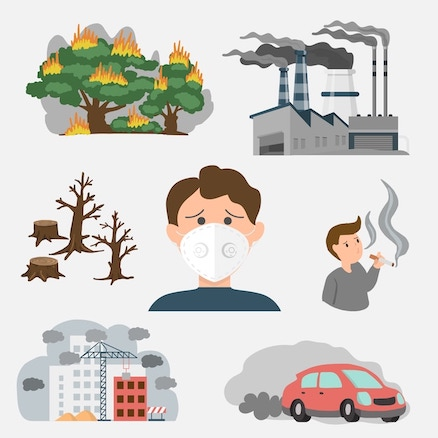

# Luchtkwaliteit

## Korte beschrijving van de cursus
We ademen de hele dag lucht in en uit, maar in deze lucht zitten nogal wat verschillende stoffen. Naast noodzakelijke stoffen, zoals zuurstof, zitten er ook allerlei ongewenste en zelfs schadelijke stoffen in de lucht om ons heen. De mens is een belangrijke veroorzaker van luchtvervuiling, en het is voor onze gezondheid hard nodig om deze vervuiling zo veel mogelijk te beperken. In deze minicursus leer je meer over de verschillende soorten luchtvervuiling, hoe ze ontstaan, welke gevolgen dit heeft voor onze gezondheid en hoe je luchtvervuiling meet. Je gaat ook zelf een fijnstofmeter in elkaar zetten waarmee je thuis kunt meten hoeveel fijnstof er in en/of om je huis rondzweeft.

## Cursusmateriaal
De presentatie van het eerste deel van de cursus, o.a. over de verschillende soorten luchtvervuiling en hoe ze ontstaan, is inclusief een samenvatting hier te downloaden: [Deel 1](Deel1.pdf)

Informatie over het in elkaar zetten en aansluiten van de fijnstofmeters is te vinden via de website www.onzelucht.nl

*(Deze informatie wordt later verder aangevuld)*

## Praktische informatie
- Cursusdata: **13 + 20 januari 2023**
- Locatie: De Jonge Onderzoekers Groningen, Dirk Huizingastraat 13
- Tijd: 18.15 tot 20 uur (pauze: 19 tot 19.15 uur)
- Minimumleeftijd: 8 jaar
- Maximumaantal deelnemers: 12
- Kosten: 4 euro per deelnemer
