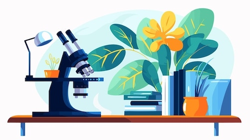

# Planten onder de loep!

## Korte beschrijving van de cursus
Planten zijn bijna overal en ze zijn heel belangrijk voor ons mensen. Het leven van planten verschilt van ons leven. Tijdens deze interactieve cursus leer je wat planten nodig hebben om goed te kunnen groeien. Je leert welke stoffen planten gebruiken uit de bodem. En hoe bladeren zonlicht inzetten om suikers te maken. Je gaat tijdens de cursus zelf een experiment met planten doen, als een echte plantenbioloog. Hiervoor ga je op de eerste avond van de cursus zelf planten ontkiemen. Thuis bekijk je vervolgens hoe je planten groeien, en op de tweede avond van de cursus onderzoek je zelf je planten met een microscoop en eventueel andere materialen van een laboratorium. Kom meedoen en leer meer over het bijzondere leven van planten!

*Deze minicursus wordt gegeven door Ties Ausma. Hij is docent en onderzoeker bij het Instituut voor Life Science and Technology van de Hanze.*

## Praktische informatie
- Cursusdata: **4 + 18 oktober 2024** *(Let op: er zit een extra week tussen de beide cursusdata om de planten voldoende tijd te geven om te kunnen groeien)*
- Locatie: De Jonge Onderzoekers Groningen, Dirk Huizingastraat 13
- Tijd: 18 tot 20 uur
- Minimumleeftijd: 8 jaar
- Maximumaantal deelnemers: 12
- Kosten: 4 euro per deelnemer
