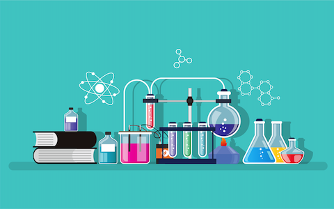

# Basiscursus scheikunde

## Korte beschrijving van de cursus
In deze basiscursus scheikunde leer je meer over een aantal belangrijke basisconcepten uit de scheikunde. Met voorbeelden uit de praktijk en een stukje geschiedenis worden de onderwerpen op een aansprekende en inzichtelijke manier behandeld, zonder dat daar allerlei ingewikkelde berekeningen of formules aan te pas komen. Hierdoor maak je op een begrijpelijke en overzichtelijke manier kennis met begrippen als bijvoorbeeld atomen en moleculen, chemische reacties, zuren en basen en eigenschappen van stoffen. De theorie zal waar mogelijk worden gedemonstreerd en aangevuld met diverse experimenten, waarvan de cursisten een aantal ook zelf mogen uitvoeren.

## Cursusmateriaal
Hier vind je het lesmateriaal behorend bij deze cursus, zoals een uitgebreide samenvatting van de lesstof, opdrachten en handleidingen.
 *(volgt later)*

## Praktische informatie
- Cursusdata: *Nog nader te bepalen*
- Locatie: De Jonge Onderzoekers Groningen, Dirk Huizingastraat 13
- Tijd: 18.15 tot 20 uur (pauze: 19 tot 19.15 uur)
- Minimumleeftijd: 8 jaar
- Maximumaantal deelnemers: 10
- Kosten: *(nog niet bekend)*
