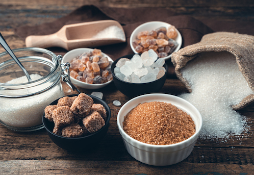

# Suikers

## Korte beschrijving van de thema-avond
Iedereen weet dat suiker zoet smaakt en dat we dat meestal lekker vinden. Maar wat zijn suikers eigenlijk? Waar zitten ze in? En kloppen de verhalen erover wel, zoals dat ze ongezond zijn en dat je er druk van wordt? Je leert tijdens deze thema-avond meer over suikers en hun rol in je lichaam, en ook ga je zelf een experiment doen met melk en lactose (melksuiker)

## Lesmateriaal
De gebruikte presentatie, inclusief een samenvatting, is [hier](suikers.pdf) *(klik)* te downloaden.

## Praktische informatie
- Datum: **21 april 2023**
- Locatie: De Jonge Onderzoekers Groningen, Dirk Huizingastraat 13
- Tijd: 18.15 tot 20 uur (pauze: 19 tot 19.15 uur)
- Minimumleeftijd: 8 jaar
- Maximumaantal deelnemers: 10
- Kosten: 2 euro per deelnemer
