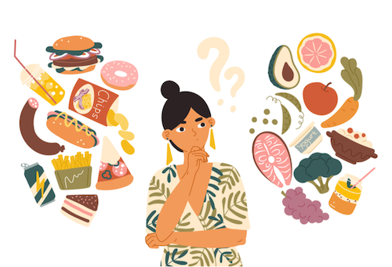

# Voeding en gezondheid

## Korte beschrijving van de thema-avond
Je ouders hebben vast wel eens tegen je gezegd dat je genoeg groente en fruit moet eten omdat dat zo gezond is. Of dat je niet zo veel chips en snoep mag hebben. Maar hoe zit dat dan eigenlijk met ons eten, waarom is het ene wel gezond en het andere niet? Wat zijn vitamines precies? En word je echt dik of druk van suiker? Je leert tijdens deze thema-avond niet alleen meer over wat er in voedsel zit en wat ons lichaam hiermee doet, maar je gaat ook zelf experimenten doen met o.a. vitamines en andere voedingsstoffen.

## Praktische informatie
- Datum: **13 februari 2026**
- Locatie: De Jonge Onderzoekers Groningen, Dirk Huizingastraat 13
- Tijd: 18.15 tot 20 uur (pauze: 19 tot 19.15 uur)
- Minimumleeftijd: 8 jaar
- Maximumaantal deelnemers: 10
- Kosten: 2,50 euro per deelnemer
