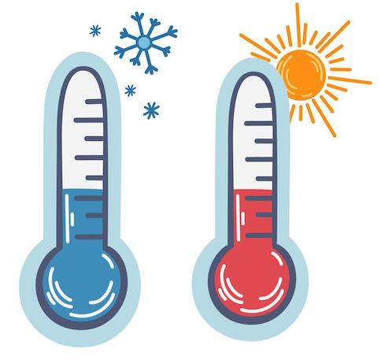

# Warm en koud

## Korte beschrijving van de thema-avond
In de zomer voelt het al snel veel te heet als het buiten meer dan 30 graden wordt. In de winter moet je juist flink je best doen om lekker warm te blijven als het een beetje vriest. Maar deze temperaturen stellen niets voor in vergelijking met bijvoorbeeld het binnenste van de zon of juist de koude leegte van het heelal. Wat betekent het eigenlijk als iets warm of juist koud is? Waar wordt dit door veroorzaakt, en kan de temperatuur eindeloos blijven dalen? Met behulp van verschillende experimenten gaan we op onderzoek uit.

## Praktische informatie
- Datum: **4 september 2026**
- Locatie: De Jonge Onderzoekers Groningen, Dirk Huizingastraat 13
- Tijd: 18.15 tot 20 uur (pauze: 19 tot 19.15 uur)
- Minimumleeftijd: 8 jaar
- Maximumaantal deelnemers: 10
- Kosten: 2,50 euro per deelnemer
