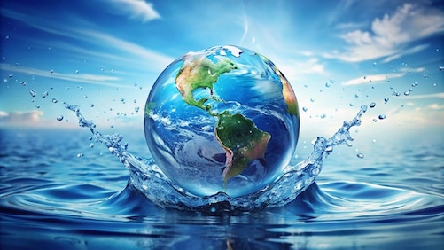

# Water: van molecuul tot milieu

## Korte beschrijving van de cursus
Zo’n twee derde van de aarde is bedekt met water. Je zou zeggen dat er dus meer dan genoeg van is. Het komt gewoon uit de kraan en we gebruiken het voor van alles: drinken, wassen, koken, tuinieren… Maar als je er wat beter over nadenkt is water eigenlijk heel bijzonder. Zonder water kan je niet leven. Wat is het geheim van deze substantie? Welke rol speelt het precies op zowel de allerkleinste als de allergrootste schaal? Tijdens deze tweedelige minicursus leer je van alles over water, van de eigenschappen van de microscopisch kleine moleculen tot aan de grootste oceanen en kringlopen die onze planeet bewoonbaar maken. We gaan verschillende experimenten uitvoeren en je leert waarom we zuinig moeten zijn met onze beperkte hoeveelheid zoet water. Hoeveel gebruik jij zelf eigenlijk op een dag? Ontdek de verschillende kanten van deze fascinerende stof en wat je kunt doen om het milieu minder te belasten.

*Een deel van deze minicursus wordt gegeven door Winnie Leenes, milieuwetenschapper bij de Rijksuniversiteit Groningen*

## Praktische informatie
- Cursusdata: **5 + 12 september 2025**
- Locatie: De Jonge Onderzoekers Groningen, Dirk Huizingastraat 13
- Tijd: 18 tot 20 uur
- Minimumleeftijd: 8 jaar
- Maximumaantal deelnemers: 12
- Kosten: 5 euro per deelnemer
