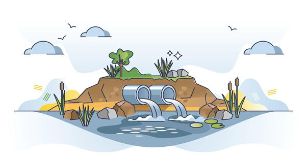

# Waterkwaliteit

## Korte beschrijving van de thema-avond
Het water in de sloten en meren in Nederland is behoorlijk vies. Er zitten te veel vervuilende en ongewenste stoffen in. Dat heeft niet alleen invloed op de planten en dieren die erin leven, maar ook op de mensen die het water gebruiken. Waar komt die vervuiling vandaan, hoe meet je die en wat zijn de gevolgen? Tijdens deze thema-avond over waterkwaliteit leer je hier meer over en ga je ook zelf slootwater onderzoeken.

## Lesmateriaal
De gebruikte presentatie, inclusief een samenvatting, is [hier](waterkwaliteit.pdf) *(klik)* te downloaden.

Zoekkaart waterdiertjes: [download](WaterdiertjesDeterminatiekaart.pdf)

Achtergrondinfo waterdiertjes: [download](AchtergrondinfoWaterdiertjes.pdf)

Meer informatie en een mogelijkheid om zelf je resultaten te delen is te vinden op de website www.waterdiertjes.nl

## Praktische informatie
- Datum: **24 mei 2024**
- Locatie: De Jonge Onderzoekers Groningen, Dirk Huizingastraat 13
- Tijd: 18 tot 20 uur (pauze: 19 tot 19.15 uur)
- Minimumleeftijd: 8 jaar
- Maximumaantal deelnemers: 10
- Kosten: 2 euro per deelnemer
