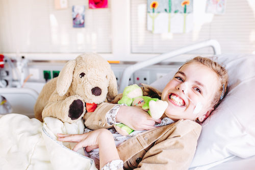

# Onderzoek aan ziektes bij kinderen

## Korte beschrijving van de cursus
Vind jij het interessant te weten hoe het menselijk lichaam werkt? En hoe het kan dat sommige kinderen ziek worden? Of hoe dokters nieuwe behandelingen voor ziektes bij kinderen ontdekken? Doe dan mee aan deze bijzondere minicursus waarbij we op bezoek gaan in het Beatrix Kinderziekenhuis (BKZ) in het UMCG. Daar vertellen een dokter en een onderzoeker je hier alles over. Daarnaast krijg je een kijkje achter de schermen in het laboratorium, waar je zelf ook mag gaan experimenteren. En je mag meedenken over hoe het onderzoek naar ziektes bij kinderen in het BKZ nog beter kan worden!

## Praktische informatie
- Cursusdata: **6 + 13 oktober 2023** *Deze cursus is vol! We proberen deze cursus vaker te organiseren, dus laat het ons weten als je belangstelling hebt om de volgende keer mee te doen*
- Locatie: UMCG/Beatrix Kinderziekenhuis
- Tijd: 18 tot 20 uur
- Minimumleeftijd: 8 jaar
- Maximumaantal deelnemers: 10
- Kosten: 4 euro per deelnemer

