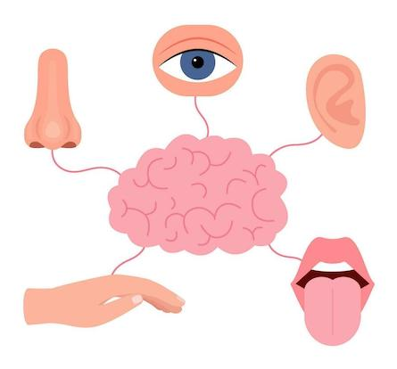

# Zintuigen

## Korte beschrijving van de thema-avond
Ga mee op ontdekkingstocht in je eigen lichaam! Tijdens deze thema-avond leren we over hoe onze hersenen, zenuwen en zintuigen samenwerken als een supersnel communicatiesysteem. Hoe weet je dat iets warm is? Waarom kun je soms iets proeven zonder het te zien? En hoe snel reageren jouw hersenen eigenlijk?
We gaan op ontdekking met leuke proefjes en opdrachten over hoe ons lichaam werkt. We testen reactievermogen, doen spannende smaak-experimenten en ervaren hoe onze hersenen soms 'in de war' kunnen raken.

*Deze thema-avond wordt gegeven door gastdocent Joost Folgering*

## Praktische informatie
- Datum: **2 oktober 2026**
- Locatie: De Jonge Onderzoekers Groningen, Dirk Huizingastraat 13
- Tijd: 18 tot 20 uur (pauze: 19 tot 19.15 uur)
- Minimumleeftijd: 8 jaar
- Maximumaantal deelnemers: 10
- Kosten: 2,50 euro per deelnemer
